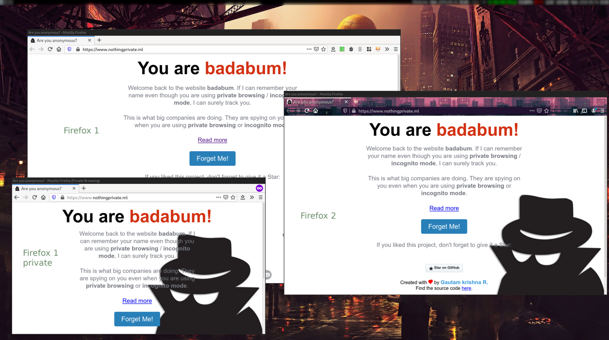

# Browsers with countermeasures
The following list shows browsers that are capable of thwarting the technology implemented by nothing-private.
Be aware that this only covers one aspect the possibilities to track you online.

There are fundamentally two technologies to thwart fingerprinting implemented in nothing-private:

## Randomizing canvas data readout

Browsers implementing this approach randomize the readout of the canvas data obtainable by websites, making each read-out differ from the last.
(Unless the readout is cached to be reused for the same site to make it harder to detect the countermeasures by the check being run twice.)

Browsers that implement this approach include

| Browser | Platform | Version | Reported By |
| ------------- | ------------- | ------------- | ------------- |
| [Firefox](https://www.mozilla.org/en-US/firefox/new/) | Windows/Linux/Mac/Android | v78+ | [cherti](https://github.com/cherti) |
| [Tor Browser](https://www.torproject.org/download/download) | Windows/Linux/Mac | 10.0+ | [RickyRajinder](https://github.com/rickyrajinder) |
| [BriskBard](https://www.briskbard.com/index.php?lang=en) | Windows| 1.6.9| [jatinsharma28](https://github.com/jatinsharma28)|
| [Pale Moon](https://www.palemoon.org/) [(See notes)](pale_moon_notes.md) | Windows/Linux | 28.5.2+ | [jragard](https://github.com/jragard) |
| [Ungoogled Chromium](https://github.com/Eloston/ungoogled-chromium) [(See notes)](ungoogled_chromium_notes.md) | Windows/Linux/Mac | 80.0.3987.149-2+ | [Nunbit](https://github.com/nunbit) |
| [Bromite](https://www.bromite.org/) | Android | v77+ | [Nunbit](https://github.com/nunbit) |
| [Brave](https://brave.com/) | Windows/Linux | v1.11.104+ | [8ram](https://github.com/8ram)|

## Making canvas data readout entirely static

This approach simply takes away the possibility to gain any information from the canvas read-out API alltogether by always blanking the returned value.
This in turn makes every browser look alike with regard to this property, but as it looks the same for every single browser, it is rendered useless for tracking purposes.

Be aware that nothing-private may still look functional, but is rendered incapable of separating even entirely different browsers with this approach as every browser now looks the same with regards to the canvas property, see screenshot below.

Browsers that implement this approach include

| Browser | Platform | Version | Reported By |
| ------------- | ------------- | ------------- | ------------- |
| [Tor Browser](https://www.torproject.org/download/download) | Windows/Linux/Mac | 8.0 - 9.5 | [RickyRajinder](https://github.com/rickyrajinder) |
| [Firefox](https://www.mozilla.org/en-US/firefox/new/) | Windows/Linux/Mac/Android | v58 - 77 | [cherti](https://github.com/cherti) |
